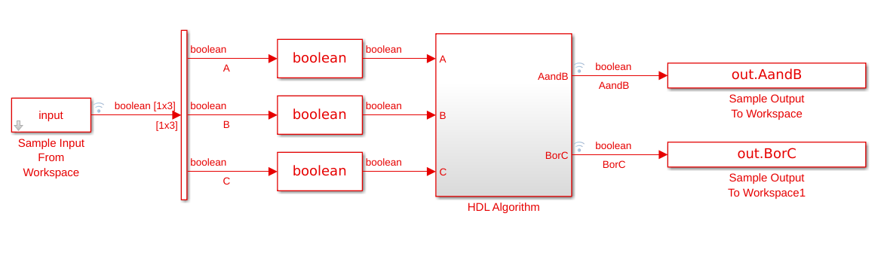
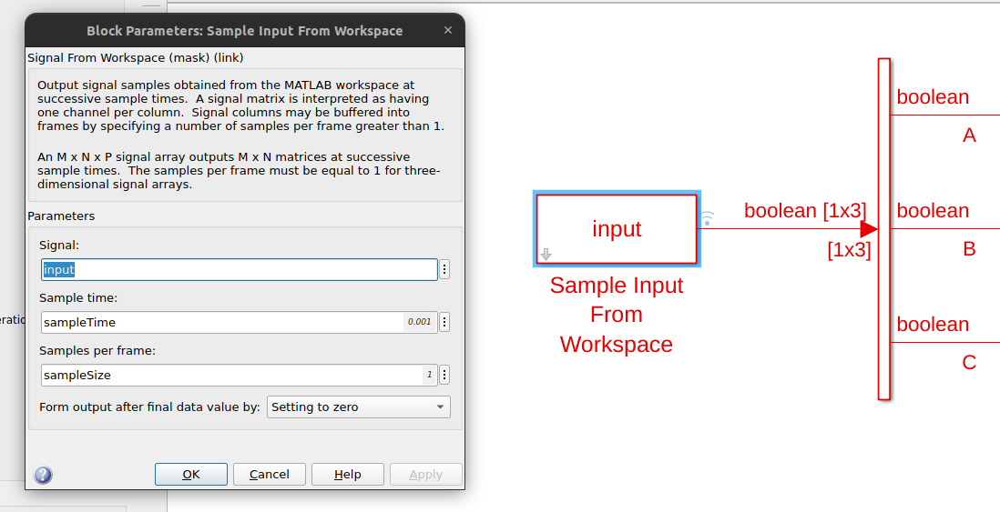
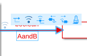
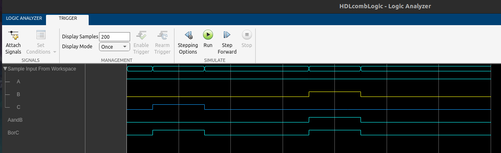

# 01 Lógica Combinacional

En este ejemplo creamos un ejemplo simple con lógica conbinacional, con las siguientes características:

* Sistema MIMO (Multiple Input Multiple Output).
* Datos de entrada enviados desde Matlab en forma serie, datos de salida leídos desde Matlab.
* Verificación del circuito de Simulink contra los algoritmos de Matlab.

## Definición de entradas

Las entradas se definen como vectores columnas, donde cada columna representa un canal de entrada. Desde Simulink, se usa el bloque `Signal From Workspace`, al cual se le indica la señal de entrada, el tiempo de sampleo (es decir, cada cuánto tiempo se van poniendo las nuevas señales), y el tamaño de la muestra (por ejemplo, si se quieren trabajar con señales de 32bits, 8bits, 1bit, etc).

## Obtención de salidas

Luego de que nuestro circuito pasa por el bloque de HDL, se obtiene a la salida un objeto del tipo `timeseries`, el cual contiene los valores de la salida en cada tiempo de sampleo.

## Simulink Logic Analyzer

Al hacer click en un conector de Simulink, aparecen unos "tres puntitos" arriba. Al pasar el cursor, se despliega un menú. El símbolo de Wi-Fi es para "loggear la señal".

Luego, es posible abrir la App del "Logic Analyzer", y ver el diagrama temporal de las señales, símil ModelSim.

