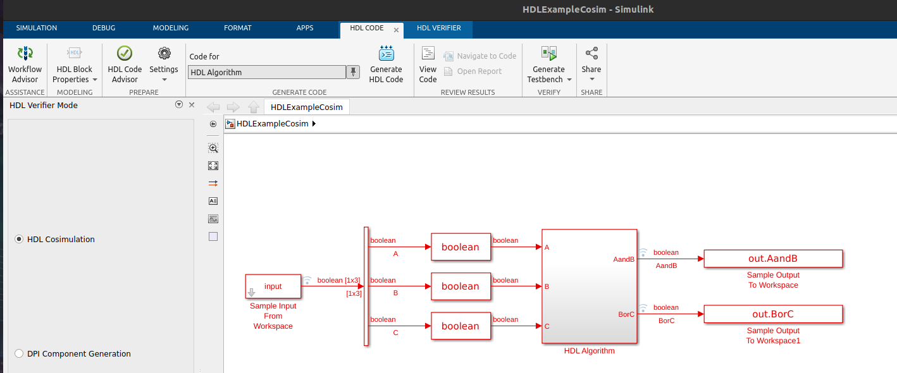
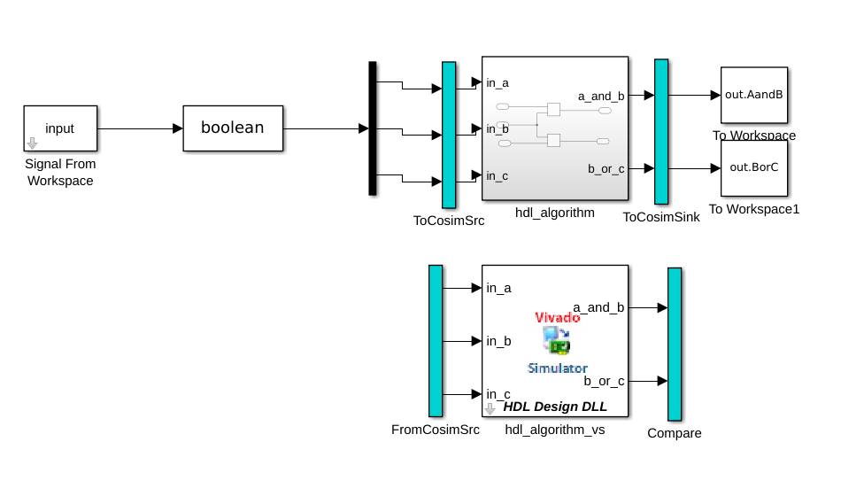
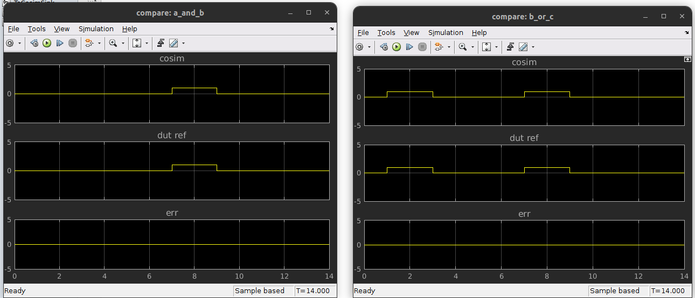
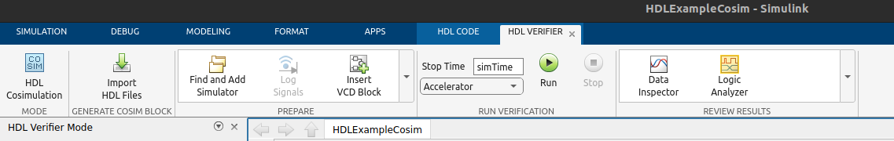
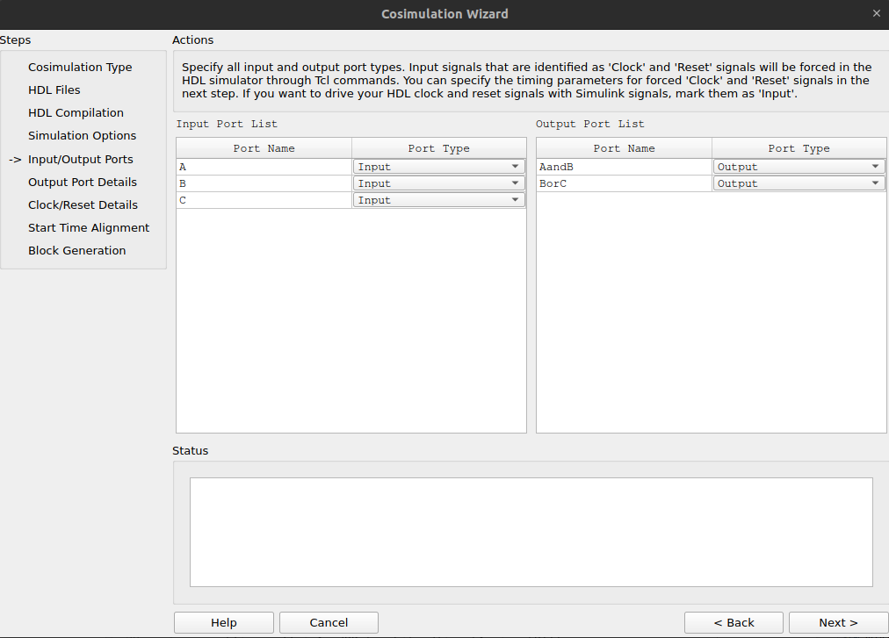
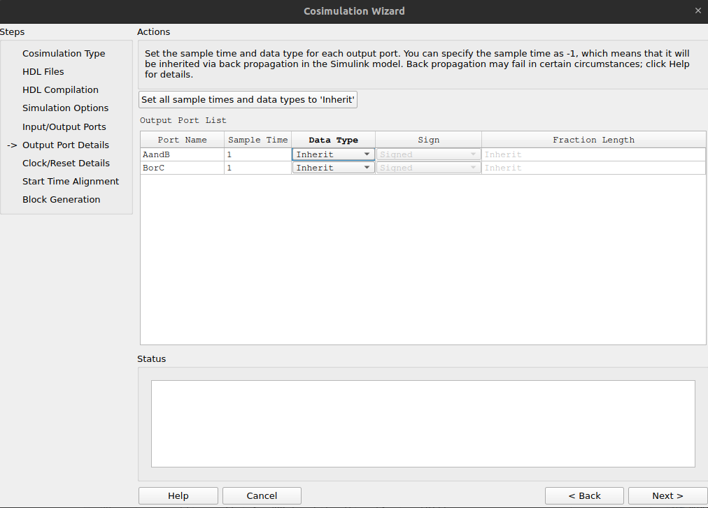
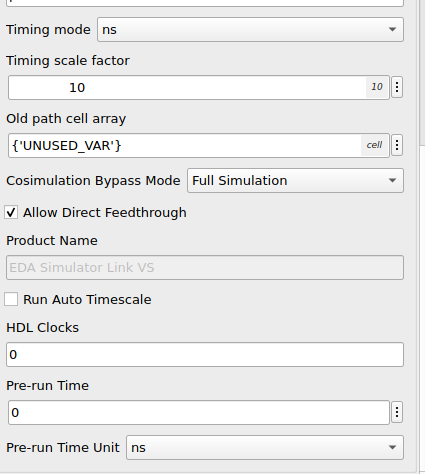
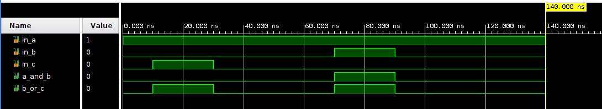

# Cosimulation

La cosimulación consiste en generar el HDL del modelo de Simulink y, en base a ese archivo, realizar la simulación del RTL con el software de Vivado.

## Generación del HDL

Creamos un modelo de Simulink en blanco.

Desde la terminal de Matlab, ejecutamos el `hdlsetup`

```matlab
>> hdlsetup("HDLExampleCosim")
```

En el Simulink, creamos un "Subsystem", que será donde pondremos todo nuestro código HDL.

Hacemos click derecho en el subsystem, "HDL Code -> HDL Code Properties" y modificamos lo siguiente:

* "->HDL Code Generation": Elegimos generar el HDL para el subsistema creado.
* "->HDL Code Generation->Test Bench": Marcamos "Cosimulation model", y seleccionamos la herramienta de simulacion "Xilinx Vivado Simulator".

Desde Simulink, vamos al "HDL Code" y realizamos los siguientes pasos:



* **HDL Code Advisor**: Corremos todos los chequeos para saber si nuestro código HDL va a compilar correctamente. Asegurarse que todos los chequeos estén en verde, no proceder en caso contrario.

* **Workflow Advisor**: Generamos el código de HDL. El último paso debería generar el archivo con el bloque de cosimulación generado.



Al correr la cosimulación, nos aparecen la comparativa de las señales de Simulink contra las señales de simulador de Vivado.



## HDL Verifier

La generación automática de la cosimulación del HDL es posible porque Simulink deduce el contexto a partir de las señales que teníamos previamente en el Simulink. Sin embargo, suele ser necesario modificar algunos parámetros.

Para eso, se puede generar el bloque de Cosimulation usando el **HDL Cosimulation Wizard**.

Abrimos la App de **HDL Verifier**, y le damos a "Import HDL Files".


Al seguir las instrucciones, podremos modificar el tipo de dato de las entradas y salidas, su tiempo de muestreo, etc.





La opción más importante resulta ser  el "Timing Scale Factor" y "Timing Mode", junto con el "Pre-run Time". Estas opciones traducen el tiempo de Simulink, al tiempo de HDL. Es decir, por cada segundo que transcurre en Simulink, transcurren 10 nanosegundos en el simulador de Vivado.



## Revisión en el simulador de Vivado

Correr todos estos programas genera mucha basura de manera automática. Uno de los archivos relevantes el es archivo `.wdb`, el cual puede ser abierto desde Vivado para verificar que la simulación efectivamente se corrió desde el simulador de Vivado.

Desde la terminal de Matlab, se pueden correr comandos de Bash si el comando empieza con un signo de admiración "!". Por ejemplo:

```matlab
>> !echo "hola"
hola
```

Para abrir el archivo, ejecutamos vivado:

```matlab
>> !vivado "hdlverifier_cosim_waves.wdb"
```

Podemos comprobar que la simulación efectivamente corrió con un tiempo de "10 ns" por cada muestra, como indicamos en el modelo de cosimulación.


