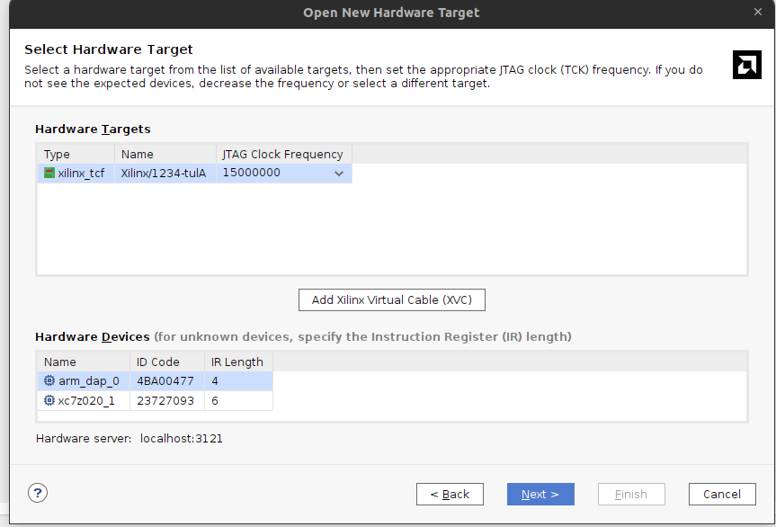
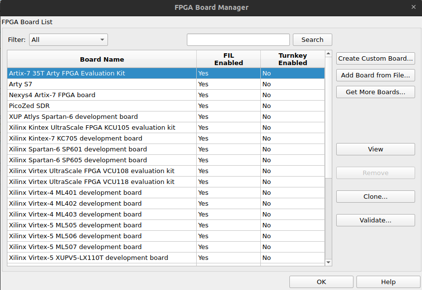
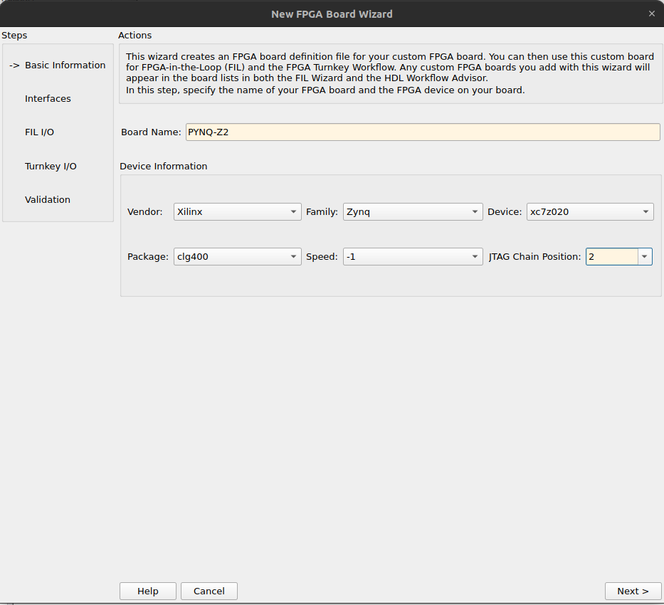
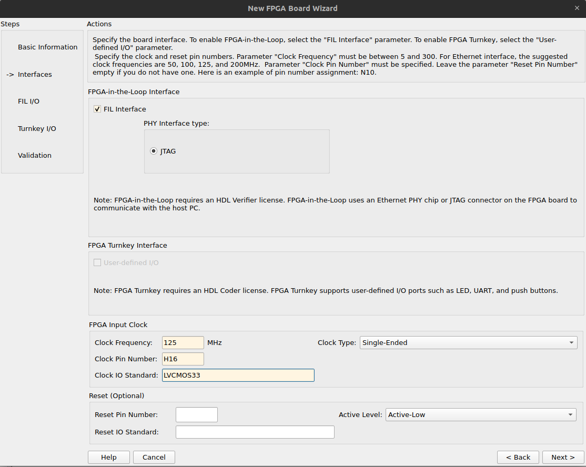
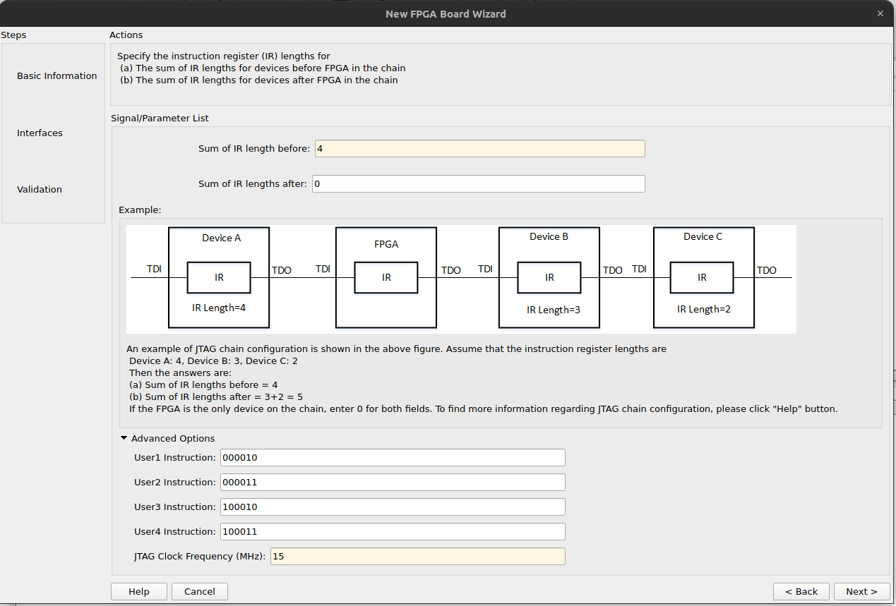
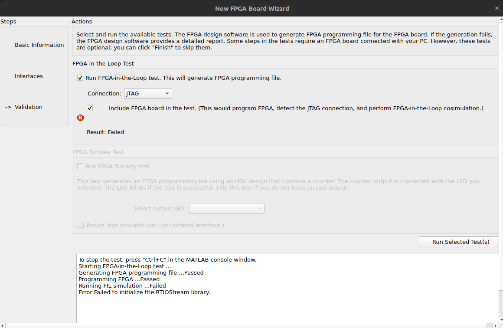
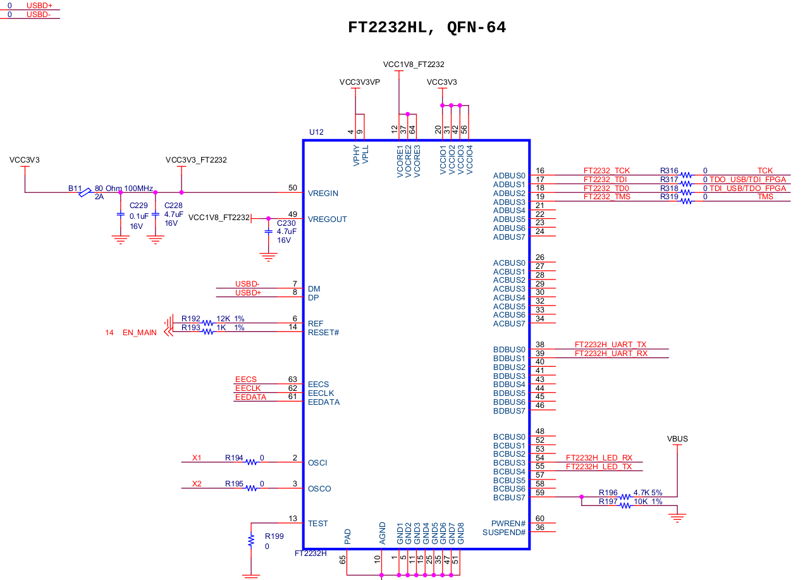

# FIL: FPGA In the Loop

**No se consiguió implementar FIL. En este README se detallan los pasos hechos para intentar hacer que funcione**

## Instalación de FIL

Los siguientes pasos de instalación fueron sacados de la documentación de Matlab para [Custom FPGA Board Definitions](https://la.mathworks.com/help/hdlverifier/custom-fpga-board-definition.html?s_tid=CRUX_lftnav)

Lo primero que tenemos que hacer es descargar el [paquete de soporte para FPGA de Xilinx](https://la.mathworks.com/matlabcentral/fileexchange/40434-hdl-verifier-support-package-for-xilinx-fpga-boards)

Luego de eso, vamos a Vivado, y abrimos el "Hardware Manager". Verificamos que la placa se pueda conectar correctamente al software de Vivado. Nos interesan los siguientes datos que aparecen en la siguiente imagen:

* **JTAG Frequency**: 15MHz.
* **arm_dap_0**: IR Length = 4.

Escribimos en la consola de Matlab el comando `fpgaBoardManager` y se abre la siguiente ventana, con algunas placas de ejemplo.

Como la PYNQ no aparece, creamos una nueva placa custom, y completamos con los siguientes datos, los cuales explico de dónde los saqué:

Los datos de la FPGA que tiene la PYNQ se sacan del datasheet. El valor de *JTAG Chain Position* lo explico más adelante.

El número de pin para el *sysclock* y e estándar se pueden obtener del archivo de contraints ".xdc", o bien del esquemático o del datasheet.

La pantalla anterior pide completar los datos del JTAG. Según la información que obtuvimos del Hardware Manager del Vivado, sabemos que la frecuencia que maneja es 15MHz, la FPGA en sí tiene un IR Length de 6, y que para programarla está el dispositivo "arm_dap_0" con un IR Length de 4 (before FPGA).

Los valores de "User1 Instruction" son los que vienen por defecto, pero se pueden verificar desde el archivo "xq7z020_cl400.bsd", el cual obtuve del Vivado desde el directorio `/home/cotti/Xilinx/Vivado/2023.2/data/parts/xilinx/zynq/public/bsdl/xq7z020_cl400.bsd`

Finalmente, el resultado falla con el siguiente error, el cual no pude encontrar solución:

En la imagen se puede apreciar que se realizan con éxito la síntesis del código HDL, y que se sube el bitstream a la FPGA, pero falla el correr la simulación desde Matlab. No pude encontrar la solución a ese error de "RTIOStream Library", y no hay ningún otro tipo de log o información al respecto. Creo que debe ser por la falta de compatibilidad de las versiones de Matlab y Vivado (Matlab R2022b y Vivado 2023.2).

Ya se verificó que los drivers de cables para FT2232HL se encuentren correctamente instalados, desde la página de [FTDI Chip D2XX Direct Drivers](https://ftdichip.com/drivers/d2xx-drivers/).

