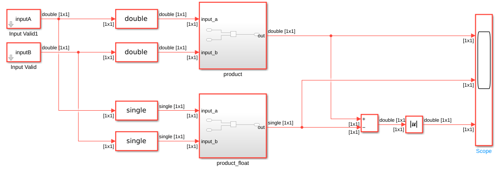
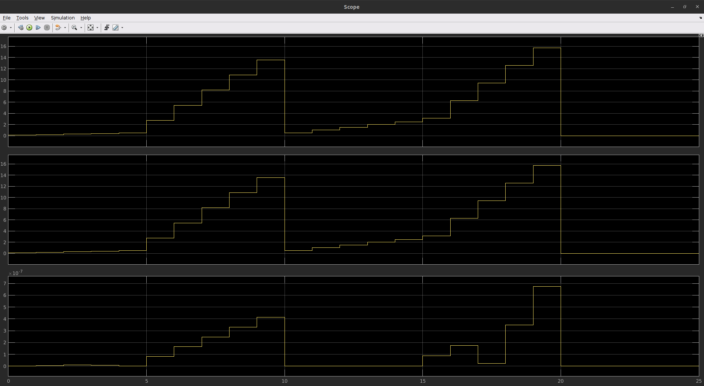
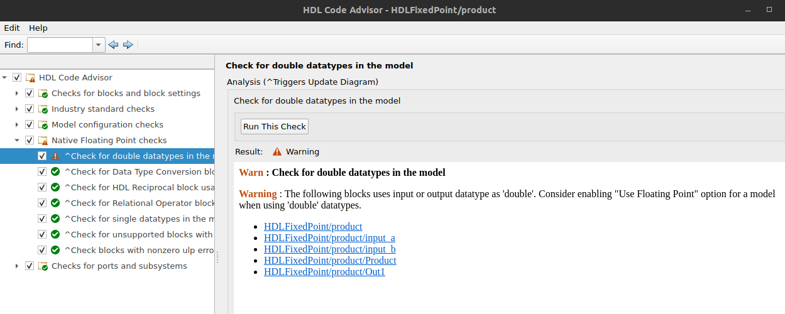
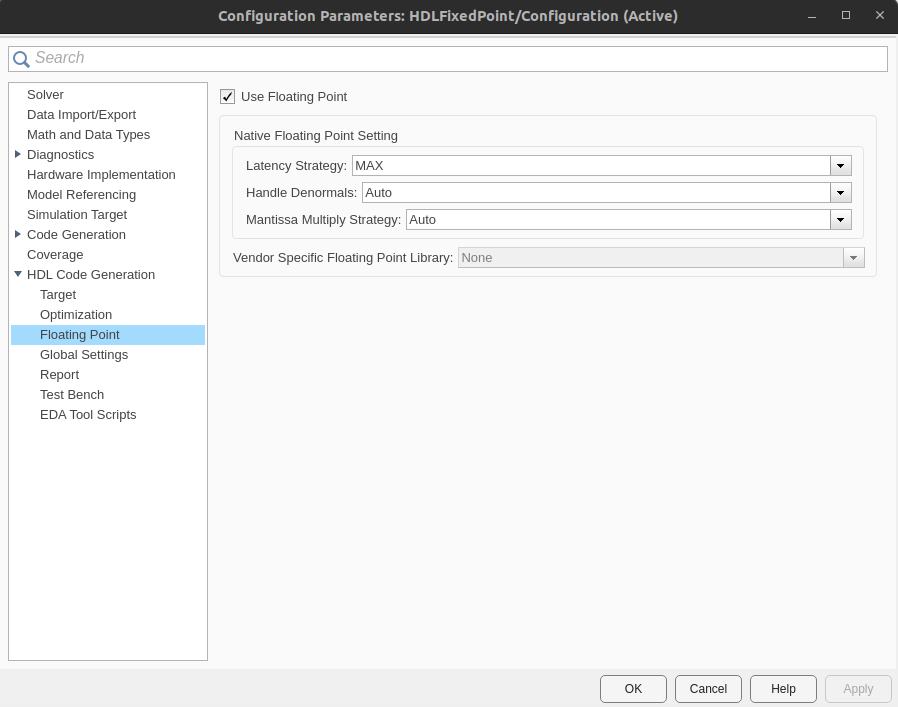
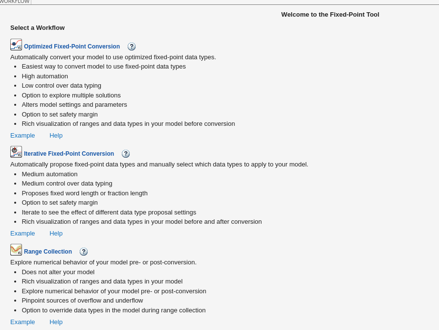
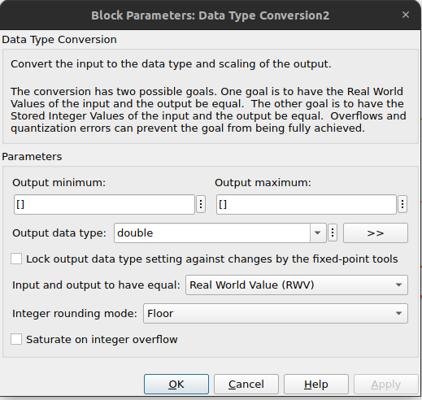

# Fixed point

En este tutorial vamos a crear una simulación que use punto fijo para representar valores.

Primero, se construye el modelo con "doubles", luego se usa la herramienta que convierte a fixed point, y finalmente se compara el error en ambos resultados.

## Circuito de ensayo

A continuación, vemos las curvas simuladas usando "double" "single" y el error entre ambos. Ya de por sí, vemos que existe un error debido a la precisión.

## HDL con punto flotante

1. Configurar el subsistema para HDL (Click derecho -> HDL Code -> HDL Coder Properties ...). Específicamente, configurar:
    * Lenguaje Verilog (no soporta VHDL + Xilinx para punto flotante).
    * Cosimulación con Vivado.

2. HDL Code Advisor. Asegurarse de pasar todos los chequeos, excepto el de uso de tipos de dato "double":

Para solucionar este warning, vamos a (Click derecho -> HDL Code -> HDL Coder Properties ... -> HDL Code Generation -> Floating Point), y activamos la opción "Use Floating Point".

3. Workflow Advisor. Corremos todos los tests, y ejecutamos la cosimulación. El resultado es el siguiente:

Notemos que el error nos marca que es eso, pero en realidad nuestro modelo corría en doubles, pero el HDL corre en floats. Hay que tener cuidado, el simulink creado para la cosimulación realiza la conversión de double a float, y compara ese resultado con el HDL.

## Fixed point optimizer

Llegado a este punto, sabemos que nuestro circuito funciona para HDL. Ahora queremos llevarlo a punto fijo para optimizar la utilización de recursos.

Vamos a "Apps" y seleccionamos "Fixed-Point Tool". Ahí, aparecen tres opciones, vamos a usar el flujo optimizado, porque al día de la fecha no somos expertos en este tema.

La interfaz es muy amena, voy a comentar algunos requisitos que son obligatorios. (ver [documentación Fixed-Point Toll](https://la.mathworks.com/help/fixedpoint/ref/fixedpointtool.html)).

1. SUD (System under design): Seleccionar que subsistema a convertir.

2. Range Collection Mode. Los modos posibles son:
    * Simulation ranges: corre la simulación, y toma el valor mínimo y máximo de cada entrada.
    * Simulation ranges with derived ranges: este es el mejor modo, porque además de inferir los valores de la simulación, toma los valores de mínimo y máximo especificados en los bloques. Específicamente, en los bloques de "data type conversion", el parámetro se llama "output minimum" y "output maximum" (nota: definir estos valores no "saturan" el input, son solamente indicativos).

    

3. Simulation Inputs: lo dehamos por defecto en las entradas del modelo.

4. Signal Tolerances. Las señales que hayas marcado en el diagrama para "loggear" (haciendo click en los puntos suspensivos al pasar el mouse sobre un cable, el signo de Wifi); aparecen para que les pongas tolerancias. Este paso es obligatorio, y toma la diferencia entre el modelo antes de usar el punto fijo y después de usar el punto fijo. La "tolerancia absoluta" es un valor absoluto, y la "tolerancia relativa" es el error relativo (|a - b|/b).

5. Apretamos "Prepare" en la barra superior, nos asegura que todos los pasos previos a realizar la optimización funcionan correctamente. Nota: puede que el sistema falle en crear el "restore point", no es obligatorio, porque el modelo está guardado en GIT y se puede restaurar en el peor de los casos.

6. En "optimization Options" podemos seleccionar cuanto tiempo darle para iterar, y el ancho máximo de palabra para cada dato.

7. Le damos a "Optimize Data Types".

8. Una vez terminado, Matlab va a seleccionar la solución que use menos bits (menor Bit Width Sum, o suma total de bits en todos los caminos), y que de también el menor error.

9. Finalmente, podemos aplicar los cambios directamente al modelo apretando "Apply and Compare".

10. Es importante exportar el script de optimización de punto fijo. Esto nos va a ayudar a saber los parámetros que usamos para realizar la optimización, en caso de necesitar realizarla devuelta.
